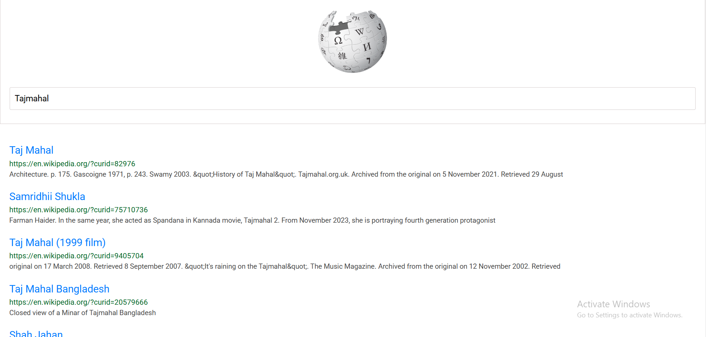

# Wikipedia Search Application

This is a simple wikipedia search application.I have built this using **HTML, CSS, Bootstrap, Javascript**

There is one input box, If the user enter the data in input box and hit the enter button the corresponding will be displayed in the UI.

## Features
 
 - There is only one input box. It allow's user enter thesearch input
- It fetches the results using Wikipedia Api
- It display's results dynamically on the webpage

## Tech-stack

- **HTML** : Used for basic structure
- **CSS** : Used for styling
- **Bootstrap** : Used for reasponsive design and UI components
- **Javascript** : Used for data from Api and displayed results in webpage

## How to use
1. Open the **index.html** file in the browser
2. Type a search query in the input box
3. Then press Enter the relevant results will be displayed dynamically

## Screenshots

